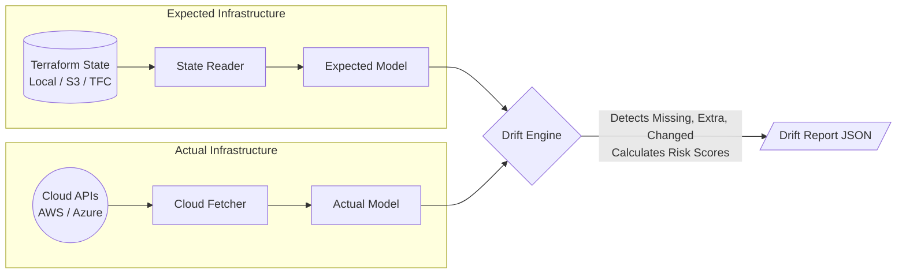

# tfdriftctl - Multi-Cloud Terraform Drift Detection

`tfdriftctl` is a tool that continuously compares your Terraform state files against live cloud infrastructure (AWS, Azure) to detect configuration drift—without needing to run `terraform plan` or `terraform apply`.

It supports local state files, remote state files (S3, HTTP, Terraform Cloud), and advanced authentication like AWS OIDC Web Identity.

It comes with a REST API, JWT Authentication, and TLS encryption out-of-the-box.

## How It Works (Architecture)



`tfdriftctl` reads your "Expected Model" from your Terraform state (Local, S3, TFC) and pulls your "Actual Model" live from Cloud APIs. The Drift Engine then compares the two models attribute-by-attribute to find any unmanaged discrepancies, alerting you to security and configuration risks before your next `terraform apply`!

### Why use `tfdriftctl` instead of `terraform plan`?
1. **Speed & Scale:** `terraform plan` re-evaluates your entire HCL codebase, downloads provider plugins, and processes data blocks. `tfdriftctl` purely compares the raw JSON state to the Cloud API, taking milliseconds instead of minutes.
2. **Continuous Compliance:** You can run `tfdriftctl` on a cron schedule (or via the REST API) continuously without needing access to your actual Terraform `.tf` source code.
3. **Risk Scoring & Automated Remediation:** Unlike Terraform which just shows a diff, `tfdriftctl` calculates a **Risk Score (0-100)** for every drifted resource (e.g., drifting a Security Group is high risk) and provides exact CLI commands to fix the drift immediately.

### Sample Drift Report
When `tfdriftctl` detects changes, it outputs a detailed report including the Risk Score and Automated Remediation suggestions. Here is an example of what the CLI table output looks like:

```text
Scan ID:    574531d4-77a9-40c0-b15a-4b5260a1e38b
Workspace:  prod-aws-us-east-1
Status:     completed
Started:    2026-06-15 09:21:21 UTC
Completed:  2026-06-15 09:21:22 UTC

SUMMARY
Total Resources:    120
Missing in Cloud:   1
Extra in Cloud:     0
Attribute Changes:  1
Tag Changes:        1
Total Findings:     3
Total Risk Score:   85

FINDINGS
KIND               SEVERITY  RISK  RESOURCE                                          FIELD          EXPECTED                      ACTUAL                        REMEDIATION
attribute_changed  warning   20    allow_web_traffic (aws_security_group)            description    Managed by Terraform          Temporarily open for testing  Run 'terraform apply -target="aws_security_group.allow_web_traffic"' to revert drift.
tags_changed       info      5     main_vpc (aws_vpc)                                tags.Env       production                    dev                           Run 'terraform apply -target="aws_vpc.main_vpc"' to fix tag drift.
missing_in_cloud   critical  60    web_server_01 (aws_instance)                                     <nil>                         <nil>                         Run 'terraform apply -target="aws_instance.web_server_01"' to recreate.
```

---

## Prerequisites
- **Go** (1.20+)
- **Cloud Credentials** (e.g., `aws configure`, Azure CLI, or configure OIDC in `tfdriftctl.yaml`)

---

## 🚀 Quick Start Guide

You can use `tfdriftctl` in two ways: as a simple CLI utility for instant ad-hoc scans, or as a background API server for continuous scheduled monitoring. 

### Pathway A: CLI Utility (Easiest)

If you just want to run an instant scan against a local or remote state file, use the CLI.

**1. Build the CLI:**
Compile the CLI tool (append `.exe` on Windows):
```bash
go build -o bin/tfdriftctl.exe ./cmd/tfdriftctl
```

**2. Run a Scan:**
Run the tool against a local state file:
```bash
./bin/tfdriftctl.exe scan --state path/to/terraform.tfstate --provider aws --region us-east-1
```

Or run against an S3 remote backend:
```bash
./bin/tfdriftctl.exe scan --state-bucket my-bucket --state s3/terraform.tfstate --provider aws --region us-east-1
```

---

### Pathway B: Continuous API Server

If you want to run `tfdriftctl` continuously on a server, schedule cron scans, and interact with it via REST API, follow these steps.

**1. Generate TLS Certificates:**
The API server runs securely over HTTPS. Generate a local self-signed certificate:
```bash
go run $(go env GOROOT)/src/crypto/tls/generate_cert.go --host localhost
```

**2. Configure Workspaces and Security:**
First, copy the example configuration file:
```bash
cp configs/tfdriftctl.example.yaml configs/tfdriftctl.yaml
```
Then, edit `configs/tfdriftctl.yaml` to update your `jwt_secret` and `admin_password`, and define your workspaces.

*Example Workspace with S3 State + AWS OIDC Auth:*
```yaml
workspaces:
  - name: aws-s3-prod
    provider: aws
    auth:
      role_arn: "arn:aws:iam::123456789012:role/MyRole"
      web_identity_token_file: "/path/to/token/file"
    state:
      backend: s3
      bucket: my-tf-state
      key: prod.tfstate
      region: us-east-1
    regions:
      - us-east-1
```

**3. Build and Start the Server:**
```bash
go build -o bin/drift-server.exe ./cmd/drift-server
./bin/drift-server.exe -config configs/tfdriftctl.yaml
```

**4. Authenticate & Trigger a Scan via API:**
```bash
# Login to get your token
curl -k -X POST https://localhost:8443/api/v1/login -d '{"password": "YOUR_ADMIN_PASSWORD"}'

# List your workspaces to get the Workspace ID
curl -k -H "Authorization: Bearer YOUR_TOKEN" https://localhost:8443/api/v1/workspaces

# Trigger a background scan
curl -k -H "Authorization: Bearer YOUR_TOKEN" -X POST https://localhost:8443/api/v1/workspaces/YOUR_WORKSPACE_ID/scans
```

---

## 🤝 Contributing New Resources

`tfdriftctl` currently supports **5 foundational AWS resources**:
- `aws_instance` (EC2)
- `aws_s3_bucket`
- `aws_vpc`
- `aws_subnet`
- `aws_security_group`

Because cloud providers have hundreds of resources, we rely on the open-source community to expand coverage! 

**How to add a new resource fetcher:**
1. Navigate to `internal/providers/aws/`
2. Create a new file (e.g., `fetch_rds.go`) using the [AWS SDK for Go v2](https://aws.github.io/aws-sdk-go-v2/docs/).
3. Map the AWS API response to the generic `model.Resource` struct.
4. Register the type in `aws.go` under `SupportedTypes()`.

Pull Requests are highly encouraged!

---

## 🔮 Future Enhancements / Roadmap

We are actively working on expanding `tfdriftctl`! Here are the major features currently in the pipeline:

1. **CIS Benchmark Mapping**: Automatically mapping detected drift to specific compliance frameworks (like the CIS AWS Foundations Benchmark). For example, if `tfdriftctl` detects an unmanaged Security Group with port 22 open, it will flag it as a critical CIS violation.
2. **Azure SDK Integration**: Full production support for Azure resources (Virtual Networks, VMs, Storage Accounts) using the official Azure SDK for Go.
3. **Automated Pull Requests**: A feature to automatically generate and open a GitHub Pull Request that fixes the drifted Terraform HCL source code.
