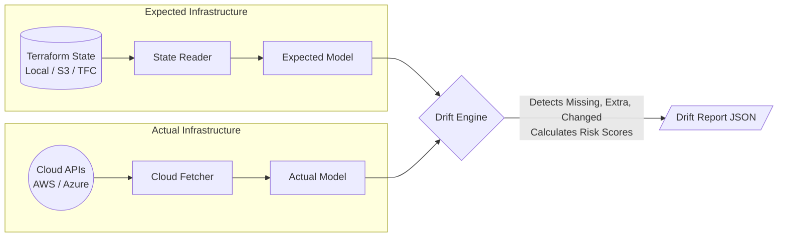

# tfdriftctl - Multi-Cloud Terraform Drift Detection

`tfdriftctl` is a tool that continuously compares your Terraform state files against live cloud infrastructure (AWS, Azure) to detect configuration drift—without needing to run `terraform plan` or `terraform apply`.

It supports local state files, remote state files (S3, HTTP, Terraform Cloud), and advanced authentication like AWS OIDC Web Identity.

It comes with a REST API, JWT Authentication, and TLS encryption out-of-the-box.

## How It Works (Architecture)



`tfdriftctl` reads your "Expected Model" from your Terraform state (Local, S3, TFC) and pulls your "Actual Model" live from Cloud APIs. The Drift Engine then compares the two models attribute-by-attribute to find any unmanaged discrepancies, alerting you to security and configuration risks before your next `terraform apply`!

### Why use `tfdriftctl` instead of `terraform plan`?
1. **Speed & Scale:** `terraform plan` re-evaluates your entire HCL codebase, downloads provider plugins, and processes data blocks. `tfdriftctl` purely compares the raw JSON state to the Cloud API, taking milliseconds instead of minutes.
2. **Continuous Compliance:** You can run `tfdriftctl` on a cron schedule (or via the REST API) continuously without needing access to your actual Terraform `.tf` source code.
3. **Risk Scoring & Automated Remediation:** Unlike Terraform which just shows a diff, `tfdriftctl` calculates a **Risk Score (0-100)** for every drifted resource (e.g., drifting a Security Group is high risk) and provides exact CLI commands to fix the drift immediately.

### Sample Drift Report
When `tfdriftctl` detects changes, it outputs a detailed report including the Risk Score and Automated Remediation suggestions:

```json
{
  "summary": {
    "total_resources": 45,
    "missing_in_cloud": 1,
    "extra_in_cloud": 0,
    "attribute_changes": 1,
    "tag_changes": 0,
    "total_findings": 2,
    "total_risk_score": 60
  },
  "findings": [
    {
      "kind": "missing_in_cloud",
      "resource_id": "aws/aws_instance/i-0abcd1234efgh5678",
      "resource_type": "aws_instance",
      "resource_name": "web_server",
      "severity": "critical",
      "risk_score": 40,
      "remediation": "Run 'terraform apply -target=\"aws_instance.web_server\"' to recreate the missing resource."
    },
    {
      "kind": "attribute_changed",
      "resource_id": "aws/aws_security_group/sg-0123456789abcdef0",
      "resource_type": "aws_security_group",
      "resource_name": "allow_web",
      "field": "description",
      "expected": "Managed by Terraform",
      "actual": "Temporarily changed for testing",
      "severity": "warning",
      "risk_score": 20,
      "remediation": "Run 'terraform apply -target=\"aws_security_group.allow_web\"' to revert the description attribute drift."
    }
  ]
}
```

---

## Prerequisites
- **Go** (1.20+)
- **Cloud Credentials** (e.g., `aws configure`, Azure CLI, or configure OIDC in `tfdriftctl.yaml`)

---

## 🚀 Quick Start Guide

Follow these steps in order to run `tfdriftctl` on your local machine.

### 1. Generate TLS Certificates
The API server runs securely over HTTPS. Generate a local self-signed certificate by running the following in your terminal:

**On Mac / Linux:**
```bash
go run $(go env GOROOT)/src/crypto/tls/generate_cert.go --host localhost
```

**On Windows (PowerShell):**
```powershell
$goRoot = go env GOROOT
go run "$goRoot\src\crypto\tls\generate_cert.go" --host localhost
```

This will generate `cert.pem` and `key.pem` in your project root.

### 2. Configure Secrets, State Backends, and Auth
Copy `configs/tfdriftctl.example.yaml` to `configs/tfdriftctl.yaml` and update the security credentials (`jwt_secret`, `admin_password`).

Configure your `workspaces` to point to your state files and cloud environments.

**Local State Example:**
```yaml
workspaces:
  - name: aws-local
    provider: aws
    state:
      backend: local
      path: path/to/your/terraform.tfstate
    regions:
      - us-east-1
```

**Remote S3 State + AWS OIDC Auth Example:**
You can bypass `aws configure` by using AWS OIDC Web Identity Token Auth!
```yaml
workspaces:
  - name: aws-s3-prod
    provider: aws
    auth:
      role_arn: "arn:aws:iam::123456789012:role/MyRole"
      web_identity_token_file: "/path/to/token/file"
    state:
      backend: s3
      bucket: my-tf-state
      key: prod.tfstate
      region: us-east-1
    regions:
      - us-east-1
```

**Terraform Cloud (TFC) State Example:**
```yaml
workspaces:
  - name: aws-tfc
    provider: aws
    state:
      backend: tfc
      workspace_id: "ws-YOUR_WORKSPACE_ID"
      token: "YOUR_TFC_API_TOKEN"
    regions:
      - us-east-1
```

**Azure Provider Example:**
```yaml
workspaces:
  - name: azure-dev
    provider: azure
    state:
      backend: local
      path: azure.tfstate
    regions:
      - eastus
```

### 3. Build the Application
Compile the server and the CLI tools (append `.exe` on Windows):

```bash
# Build the API Server
go build -o bin/drift-server.exe ./cmd/drift-server

# Build the CLI
go build -o bin/tfdriftctl.exe ./cmd/tfdriftctl
```

### 4. Start the Server
Run the API server in your terminal:
```bash
./bin/drift-server.exe -config configs/tfdriftctl.yaml
```

### 5. Authenticate & Trigger a Scan
In a new terminal window, authenticate with your password to receive a JWT token:
```bash
# 1. Login to get your token
curl -k -X POST https://localhost:8443/api/v1/login -d '{"password": "YOUR_ADMIN_PASSWORD"}'

# 2. List your workspaces to get your internal Workspace ID
curl -k -H "Authorization: Bearer YOUR_TOKEN" https://localhost:8443/api/v1/workspaces

# 3. Trigger a scan using the Workspace ID from the previous step
curl -k -H "Authorization: Bearer YOUR_TOKEN" -X POST https://localhost:8443/api/v1/workspaces/YOUR_WORKSPACE_ID/scans
```

---

## CLI Usage (Ad-hoc Scans)

If you don't want to run the background server, you can use the CLI tool to perform instant, ad-hoc scans directly against a state file:

```bash
./bin/tfdriftctl.exe scan --state path/to/terraform.tfstate --provider aws --region us-east-1
```

For S3 backends, you can use:
```bash
./bin/tfdriftctl.exe scan --state-bucket my-bucket --state s3/terraform.tfstate --provider aws --region us-east-1
```
